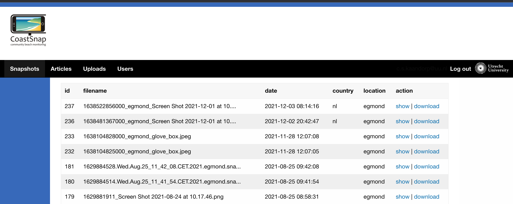

# CoastSnap Web application

A Phoenix Web application that enables beach visitors to upload coastline pictures.

## Table of Contents
* [General info](#general_info)
* [Technologies](#technologies)
* [Setup](#setup)
    * [Deployment](#deployment)
    * [Create first admin](#create_first_admin)
* [Content Management System](#content_management_system)
    * [Access and Authentication](#access_and_authentication)
    * [Coastline Pictures](#coastline_pictures)
    * [Articles](#acticles)
    * [Uploads](#uploads)
    * [Users](#user_accounts)
* [Frontend behavior](#frontend_behavior) 
* [Processing the coastsnaps](#processing_the_coastsnaps)

## General Info

CoastSnap is a global citizen science project to capture changing coastlines. With our web application we enable beach visitors to quickly upload photos from the coastline. Besides the upload feature, the app also provides a simple website for additional information about the project.

## Technologies
* Phoenix Framework version: 1.5.10
* Elixir version: 1.11.3
* PostgreSQL version: 13
* Node version: 14.18.2
* Zurb Foundation version: 6.7.3
* NginX version: 1.20.2
* Python version: <= 3.7.1
    * [Falcon](https://falcon.readthedocs.io/en/stable/) version: 3.0.1
    * [Gunicorn](https://gunicorn.org/) version: 20.1.0

## Setup

### Deployment

This app is deployed on a CentOS7 Linux machine. It requires installing Elixir, PostgreSQL, Node, NginX, Python, Falcon and Gunicorn. After 
installing PostgreSQL a Postgres user has to be created with permissions to create, write and read databases and tables.
Once the required software is installed pull this repository in and add a file called 'prod.secret.exs' in the config 
folder which configures the database connection and the domain name:

```
use Mix.Config

config :coast_snap, CoastSnap.Repo,
        username: "< username database >",
        password: "< password database >",
        database: "< database name >",
        hostname: "localhost",
        pool_size: 10

config :coast_snap, CoastSnapWeb.Endpoint,
        server: true,
        http: [port: 4000, transport_options: [socket_opts: [:inet6]]],
        # change domain name if necessary
        url: [host: "coastsnap.nl", port: 80],
        check_origin: [
                "https://coastsnap.nl",
                "http://coastsnap.nl:4000"
        ],
        secret_key_base: "< create secret with: mix phx.gen.secret >"
```
Once in place, run the following command in the root directory of the app to create the database:
```
$ mix ecto.create
```
The app will receive uploaded files from two streams: the coastline pictures (snaps) and files that were uploaded by the administrators (uploads). To avoid collisions between these streams, create two folders to store the uploaded contents.
```
mkdir -p ~/uploads
mkdir -p ~/snaps
```

Processing the uploaded coastsnaps is done with a Python script. To facilitate this we have created a tiny Falcon server (`/priv/python/rest_server.py`) that runs this script in a threat. To run this server as a service we have to create the following `.service` file and add it to the `/etc/systemd/system` folder as `falcon_snap.service`:

```
[Unit]
Description=Gunicorn instance to serve the falcon application
After=network.target

[Service]
WorkingDirectory=/home/kaand006/apps/coast_snap/priv/python
ExecStart=/home/kaand006/anaconda3/bin/gunicorn --workers 3 rest_server:app
ExecReload=/bin/kill -s HUP $MAINPID
ExecStop=/bin/kill -s TERM $MAINPID

[Install]
WantedBy=multi-user.target
```

To start/stop the server use:
```
$ sudo systemctl start falcon_snap   # start
$ sudo systemctl stop falcon_snap    # stop
```

Use the following script on the server to deploy the website:
```
#!/bin/bash

# stop the Falcon server
sudo systemctl stop falcon_snap

# folder used to store uploaded web contents
upload_folder="/home/kaand006/uploads"
# folder used to store coastline snaps
snaps_folder="/home/kaand006/snaps"

# cd into working directory
cd /home/kaand006/apps/coast_snap
# pull repo
git fetch origin
git reset --hard origin/master

# after pulling we can start the Falcon server again
sudo systemctl start falcon_snap

# cd into assets folder
cd assets
# compile frontend resources
npm install
# cd back into main folder
cd ..
# fetch dependencies
mix deps.get --only prod
# compile application
UPLOADS_DIR=$upload_folder SNAPS_DIR=$snaps_folder MIX_ENV=prod mix compile
# migrate the database
MIX_ENV=prod mix ecto.migrate
# compile assets (js, css, images)
npm run deploy --prefix ./assets
MIX_ENV=prod mix phx.digest
# overwrite the previous release with this one
sudo UPLOADS_DIR=$upload_folder SNAPS_DIR=$snaps_folder MIX_ENV=prod mix release --overwrite
# stop the previous release
sudo /home/kaand006/apps/coast_snap/_build/prod/rel/coast_snap/bin/coast_snap stop
# and start the current one
sudo /home/kaand006/apps/coast_snap/_build/prod/rel/coast_snap/bin/coast_snap daemon
```
Note that stopping and starting the Falcon service requires sudo permissions, the script will prompt for your credentials. Also note the required environment variables `UPLOADS_DIR` and `SNAPS_DIR`! They need to refer to the paths of the upload folders we have created in the previous steps.

After execution, check whether the Falcon server is running and if the application has started:
```
$ ps ax | grep gunicorn
$ ps ax | grep coast_snap
```
Besides the Phoenix daemon process, another `coast_snap` Elixir process should be running, alongside a number of database processes. **If this is not the case run the deploy script again**.

#### Running locally 

Make sure you set the environment variable `UPLOADS_DIR` and `SNAPS_DIR` before you start the local server or start the app like this:
```
$ UPLOADS_DIR=<PATH/TO/UPLOADS> SNAPS_DIR=<PATH/TO/SNAPS> iex -S mix phx.server
```
If you don't provide these folders, the app will set both folders to `/priv/static/uploads`

### Create first admin

To get access to the uploaded coastline pictures, and the rest of the backend you need to have a confirmed user account. Confirmation can only be done by a confirmed user. To create the first user account take the following steps:
1. Register at [https://coastsnap.nl/users/register](https://coastsnap.nl/users/register)
2. SSH into the server, and change the working directory to the application folder. Ensure the app is running. Access the application and confirm the first user with the following commands:
```
$ _build/prod/rel/coast_snap/bin/coast_snap remote

# this will start the Elixir prompt, then (assuming
# the first user has id number 1):
iex> user = CoastSnap.Accounts.get_user!(1)
iex> CoastSnap.Accounts.confirm_user(user)
```

## The Content Management System

The CoastSnap web application has a very simple content management system (CMS). It allows anybody with a confirmed user account to create, update and delete coastline pictures, website articles, images and documents and user accounts:



### Access and Authentication

If you have a confirmed user account browse to [https://coastsnap.nl/admin](https://coastsnap.nl/admin). If you are not logged in, you will be redirected to the login page, use your credentials and click on the 'log in' button. This action is going to redirect you to the admin page.

Authentication is simple. You can't provide roles to user accounts in order to manage permissions. A confirmed user account will give access to all.

### Coastline pictures

Under the menu item 'Snapshots' users can find database entries for uploaded coastline pictures. Besides filename and information about when and where the picture was uploaded can be found on this page. Per entry 2 actions are possible: show will direct you to a page in which the image can be seen, and the download-action will download the image on your local filesystem. __Images can be removed__ on the 'show' page in order to minimize unwanted deletions. The system asks for a confirmation before deletion.

### Articles

By creating an Article you are going to add a page on the Coastsnap website. Click on the 'Create Page' button to create a new page. Every page will get a position in the navigation section. Every page can have one or more subpages. But a subpage can't have subpages; the navigational structure is only 2 pages deep.

The form contains a number of fields:

1. Position: this integer is used to generate the navigational structure. Lower numbers will appear sooner in the menu.
2. Parent: applies to subpages. This dropdown will let you select the parent page. The options are the NL navigation titles.
3. Slug: the website uses slugs instead of id numbers. Provide a string. The system will downcase it and replace spaces with underscores.
4. For the Dutch, English and German language a navigation and content field are available. **All navigation fields are mandatory**. The string in the navigation fields are used in the navigation menu of the front end. The content fields are very simple: add your HTML in here and it will be rendered as is. There is **no** HTML editor.
5. Published: pages that aren't published are not visible on the front end.

#### Updating, deleting and adding subpages

Once a (sub)page is created, it can be updated by clicking on its `edit` link in the listing. Deleting is done by clicking on the `destroy` link. Note that pages that are a parent of subpages can only be deleted if all children are moved away from the parent, or deleted first.

Subpages can be added by clicking on the 'Create Page' button (fill out parent!), or by clicking on the `add subpage` link of a first level article. 

### Uploads

Uploads are not be confused with the uploaded coastal snaps! This resource is made available to enrich the contents of the website. Upload images or documents and display/link them in an Article. In the upper part you can find a simple upload form, all uploaded files can be found below it in a paginated table. Every uploaded file has a `copy URL` link which will add its URL in your clipboard. Use it in the contents of an Article. Uploaded files can be deleted directly, but realize you may delete a file which URL is used in an Article!

### Users

The CMS is accessible to anyone who has a confirmed user account (admins). Under `Users` we can find a list of all registered users accounts. Some of them might not be confirmed. If a new user registers, he/she needs to wait until an existing admin confirms the new account. Confirming is done by clicking the `confirm` link on the right hand side of the appropriate user account.

Registered users have to contact an admin if they forget their password. The current setup does not provide an email server. The admin has to click on the `forgot password` link of the appropriate user account. This will reveal a ready made email text that needs to be copy-pasted into a real email client and send to the person in question.

A user account can be deleted by clicking the `destroy` link.

### Processing the coastsnaps

The uploaded coastsnaps are processed with a Python script. If a person uploads a picture to the system, the processed image must be shared with him/her. But processing time may exceed the normal timeout of a web request. Furthermore we want to avoid that the image processing has an influence on the performance of the webserver. Therefore we have split up the web application from the image processing. This is done by running a second dedicated Python server (Falcon). Its sole job is to receive image-processing requests from the Phoenix application and spin up a Thread for every new image in which it can be processed.

At the moment a queue in the Phoenix app delegates the Falcon server. This has pros and cons. The queue guarantees sequential processing and will avoid peek loads on the server. But it waits for every processing job to finish. If multiple images are uploaded in a short period of time, visitors will have to wait longer before they can see the result. After uploading every visitor is redirected to a LiveView page which has id information about the taken coastsnap. It shows the uploaded picture by default and waits (indefinitely) for the processing result. With this background information we can summarize the processing route of an uploaded image:

1. Once the image is uploaded to the Phoenix app it is added in a queue in the GenServer `SnapProcessingQueue (/lib/coast_snap/gen_servers/snap_processing_queue.ex)`.
2. If there is no other image being processed at the moment, a POST request will be send to the Python Falcon server containing the filepath, country, location and id number of the `SnapShot` record.
3. Falcon will spin up a Threat which is going to deal with processing the uploaded image.
4. Once processed, the processed image is stored on the filesystem. The Phoenix app is notified with a PUT request to the Phoenix controller `PythonController (/lib/coast_snap_web/controllers/python_controller.ex))`. This request also contains the id number of the `SnapShot`.
5. The controller updates the `SnapShot` record of the original image with the information that a processed counterpart has been made, it then adds the processed image to the database as a new `SnapShot` record, notifies the GenServer's queue to start processing the next image, and broadcasts to the LiveView `PageLive (/lib/coast_snap_web/live/page_live.ex)` that the processed counterpart can be shown.